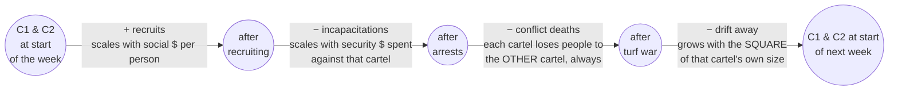
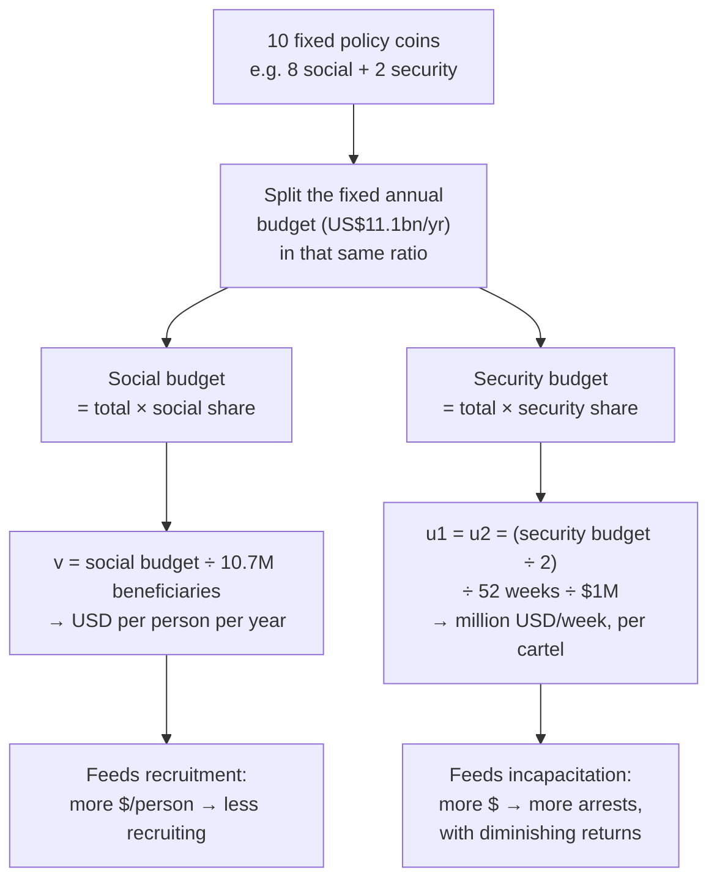
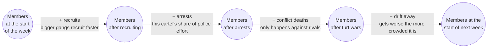
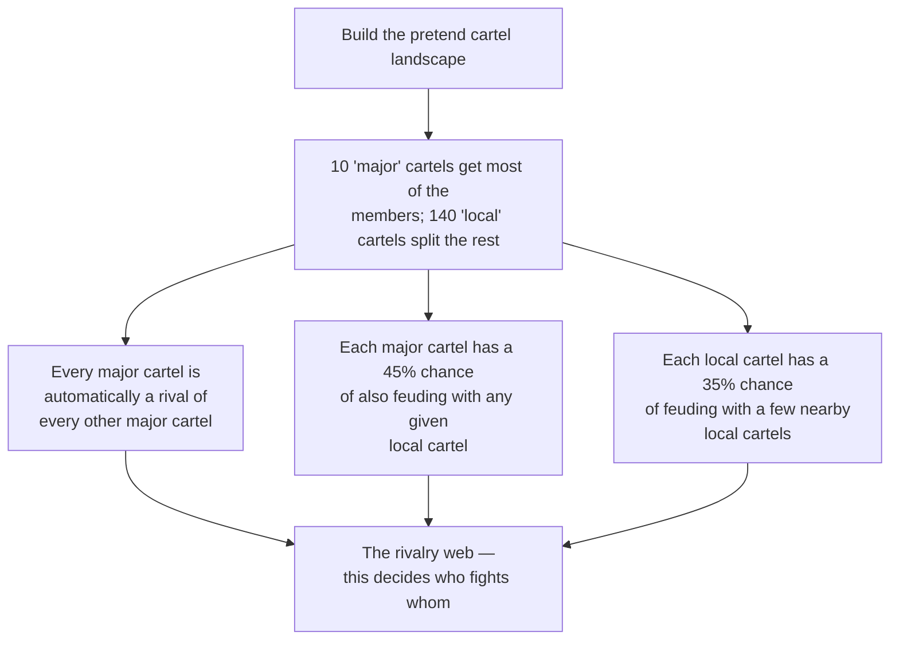
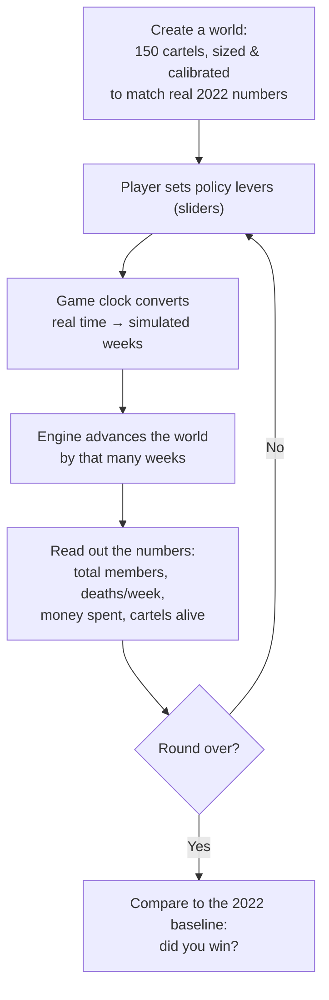
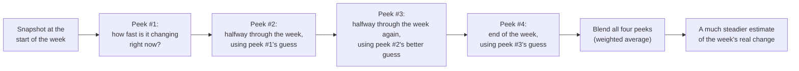

# The Cartel Engine

A little simulation of what it would take to shrink Mexico's cartels,
built from real published research. This document explains **how it
works and why**, without assuming you know any math. If you're
curious about the formulas, that's saved for the end of each part.

---

## Two engines, two papers

This repo actually contains **two different simulation models**, built
from two different pieces of research, at two different points in
this project's life:

| | Model | Cartels | Papers it's from | Files |
|---|---|---|---|---|
| **Current** | Two-cartel budget-allocation model | 2 (rivals) | Updated policy paper on how a *single fixed security budget*, split between social and security spending, shapes cartel size and violence | [`web-dashboard/src/cartel_engine.ts`](web-dashboard/src/cartel_engine.ts) |
| **Legacy** | 150-cartel four-lever model | 150 | Prieto-Curiel, Campedelli & Hope, *Science* 381:1312–1316 (2023) | [`cartel_engine.py`](cartel_engine.py), [`cartel_engine.ts`](cartel_engine.ts), [`live_dashboard.py`](live_dashboard.py) |

**The browser dashboard you actually play today
([`web-dashboard/`](web-dashboard/)) runs the current, two-cartel
model** — that's [Part 1](#part-1--the-current-engine-two-cartels-one-budget-dial)
below. The original 150-cartel model still lives in the repo root and
still powers the Python desktop dashboard; it's documented in
[Part 2](#part-2--the-legacy-engine-150-cartels-four-levers) and in
[USAGE.md](USAGE.md).

They are not two versions of the same thing — they're genuinely
different models with different mechanics. Don't assume a fact from
one part applies to the other.

---

## Part 1 — The current engine: two cartels, one budget dial

*(what actually runs in [`web-dashboard/`](web-dashboard/) today)*

### What this actually is

This model simplifies the picture down to **two rival cartels**
splitting a country between them, and asks one question: if you have a
**fixed annual policy budget**, how should you split it between
*social programs* (which reduce recruitment) and *security spending*
(which increases arrests), and what happens to cartel size and
violence over the following years?

Unlike the legacy engine's four independent levers, this model gives
you exactly **one dial**: how much of a fixed pie goes to social vs.
security. Everything else — conflict between the two cartels, and
each cartel's own internal instability — happens on its own; you don't
control it directly, you only influence it indirectly through your one
dial.

It is not a prediction tool. It's a calibrated toy that behaves the
way the underlying research says the real trade-off behaves, so that
moving the dial teaches you something true about diminishing returns
and unavoidable violence.

### The big idea: two bathtubs, draining into each other

Picture two bathtubs, one per cartel, both starting at **25,000
people** (50,000 combined — roughly the low end of published cartel
membership estimates). Every simulated week:

- **In:** new recruits, for each cartel
- **Out:** people who get arrested (that cartel's own security
  spending), people killed in conflict *with the other cartel*, and
  people who drift away on their own



*(As before, all four things really happen at once in the code — this
chain is just the easiest way to picture it.)*

### Meet the four forces

#### 🟢 Recruitment — people joining, per cartel

Each cartel recruits in proportion to how many members it already has
— bigger cartel, more recruiters, faster growth — but that baseline
rate is *dampened* the more social support money reaches people per
year. Zero social spending gives you the full, undamped recruitment
rate; more social $/person pushes recruitment down exponentially, but
never quite to zero.

> **What controls it:** the *social* share of your one budget dial.

#### 🚔 Incapacitation — people getting arrested, per cartel

Unlike the legacy model (where a single police budget gets diluted
across 150 cartels), here **each cartel is targeted with its own
security money** — the security budget is split evenly between the two
rivals. More money spent against a cartel means more arrests, but with
**diminishing returns**: doubling the security budget against a cartel
less than doubles the arrests, because √ (square-root-like) returns are
built into the formula.

> **What controls it:** the *security* share of your one budget dial.

#### ⚔️ Conflict — people killed by the rival, always

This is the one force that was *optional* in the legacy engine (rivals
had to be linked in a rivalry web) but is now **guaranteed**: there
are only two cartels, and they are always rivals. Each cartel loses
people in proportion to **both** cartels' size at once — two small
rivals barely scratch each other, two huge rivals tear each other
apart.

> **What controls it:** nothing you touch directly. It's pure math —
> `size of cartel 1 × size of cartel 2 × a fixed lethality constant` —
> and it's the same regardless of how you split your budget. The only
> way to reduce it is to shrink the cartels themselves.

#### 🚪 Saturation — people drifting away on their own

Exactly like the legacy model: every cartel loses a trickle of members
to natural attrition that grows *faster* than the cartel itself. This
is what caps runaway growth — a bigger, more crowded cartel is
inherently harder to hold together.

> **What controls it:** nothing you touch directly either. This, like
> conflict, is a pure consequence of each cartel's own size.

**The key mechanical difference from the legacy engine:** conflict and
saturation used to be adjustable ("seal the cracks", "open the drain").
In this model they are **fully endogenous** — automatic losses that
happen no matter what you do. Your one dial only ever touches
recruitment and incapacitation.

### The one lever: the budget dial

You have **10 fixed policy coins**. Every coin you put on `SOCIAL`
comes off `SECURITY`, and vice versa — the total is always 10, so you
are always trading one thing for the other, never getting "more" of
both.



The **default starting split is 8 social / 2 security** — roughly
today's real-world allocation. From there you can move coins one at a
time toward either extreme (10/0 or 0/10) and watch both charts react.

### The "do nothing" comparison

The dashboard's dashed red line is **not** "0 social / 10 security."
It's a true no-policy world: the whole $11.1bn/year budget is zeroed
out, so both social support (`v`) and security spending (`u1`, `u2`)
are exactly 0. Recruitment runs at its full, undamped rate and no one
gets arrested — but conflict and saturation still happen, because
those were never under budget control to begin with. This is the
honest baseline your allocation is compared against.

### RK4: why the engine "peeks" four times a week

Same technique as the legacy engine, just applied to two coupled
cartels instead of 150. If you only checked "how fast is membership
changing *right now*" once and assumed that held for the whole week,
you'd get a rough answer — rates keep shifting as the week goes on. So
the engine peeks at the rate of change **four times** across the week,
each peek informed by the last, then blends all four into one steadier
estimate (the well-known **Runge-Kutta 4 / RK4** method). Advancing by
more than one week just repeats this once per week internally, so a
10-year jump behaves identically to 520 separate one-week jumps.

### What "better" looks like

There's no score, just an honest comparison against the starting
point. Your allocation is "below baseline" at any moment if **both**:

- combined membership (C1 + C2) is at or below the 50,000 starting
  level, and
- weekly cartel-on-cartel homicides are at or below the ~15/week
  starting level

This is a neutral comparison, not a win condition — the dashboard also
shows you directly against the true "do nothing" trajectory, which is
usually the more interesting comparison.

### Glossary (code names → plain English)

| In `web-dashboard/src/cartel_engine.ts` | Plain English |
|---|---|
| `C1`, `C2` | Members currently in cartel 1 / cartel 2 |
| `socialCoins` / `securityCoins` | How your 10 fixed coins are split (always sums to 10) |
| `policy.socialSupportPerPersonAnnualUSD` (`v`) | Social $ reaching each beneficiary per year |
| `policy.securityPerCartelMillionUSDPerWeek` (`u1`/`u2`) | Security $ (millions/week) aimed at each cartel |
| `weeklyHomicides` | Cartel-on-cartel deaths this week, both cartels combined |
| `advanceByWeeks(n)` | "Run the simulation forward by `n` weeks" |
| `CartelWorld.createDoNothing()` | Builds the true zero-budget comparison world |
| `isBelowBaseline()` | Is this allocation currently beating the 50,000-member / 15-homicide starting point? |

### For the curious: the actual equations

```
dC1/dt = R1 − I1 − H − S1
dC2/dt = R2 − I2 − H − S2

Ri = ρ · b · e^(−σv) · Ci        (recruitment — decays with social $/person)
Ii = η · (ui · Ci)^π             (incapacitation — diminishing returns, π = 0.5)
H  = θ · C1 · C2                 (conflict — lost by EACH cartel; total deaths = 2H)
Si = ω · Ci²                     (saturation — grows with the square of cartel size)
```

- `v` — social $ per beneficiary per year; `ui` — security $ (millions/week) aimed at cartel *i*
- `ρ`, `b` (recruitment baseline), `σ`, `η`, `π`, `θ` — fixed constants calibrated from the paper, not player-controlled
- `ω` (saturation rate) has **two candidate values** in the source paper: the Supplementary
  Table reports `7.53e-8`, while the Methods prose derives `5.2e-8`. The engine defaults to the
  Supplementary Table value (it reproduces the near-flat current trajectory more closely) but
  keeps the alternative as `OMEGA_METHODS_TEXT` for quick sensitivity testing.

---

## Part 2 — The legacy engine: 150 cartels, four levers

*(still used by [`cartel_engine.py`](cartel_engine.py),
[`cartel_engine.ts`](cartel_engine.ts) and
[`live_dashboard.py`](live_dashboard.py); full API reference in
[USAGE.md](USAGE.md))*

### What this actually is

In 2023, three researchers (Prieto-Curiel, Campedelli & Hope) published
a model in the journal *Science* estimating how many people belong to
Mexican cartels, and what it would take to bring that number down.
This engine takes their model and turns it into something you can
*play with*: a simulated world of 150 cartels that you nudge using four
policy "levers," watching membership and violence rise or fall in
response, one simulated week at a time.

### The big idea: think of it like a bathtub

Every cartel is its own bathtub of people. Water flows in and water
flows out, every single week:

- **In:** new recruits
- **Out:** people who get arrested, people who get killed in gang
  conflict, and people who just drift away

The whole simulation is 150 of these bathtubs side by side, some of
them plumbed together by rivalry — when two rival cartels are both
big, they drain each other faster.



*(In the code all four things actually happen at once, not one after
another — this chain is just the easiest way to picture it.)*

### Meet the four forces

**🟢 Recruitment** — new members show up in proportion to how many a
cartel already has; success breeds success.
> **Lever:** *"Close the tap"* (recruitment prevention) — up to 100% off.

**🚔 Incapacitation** — a fixed pool of police/military effort each
week, split across *all* cartels in proportion to size, so a cartel
with 10% of all members absorbs about 10% of all arrests.
> **Lever:** *"Run the pumps"* (enforcement effort) — the only lever
> that can go *above* normal, up to 85% more arrests than 2022.

**⚔️ Conflict** — deadliest force, and the only one depending on two
cartels at once: only happens between rivals, scaling with **both**
cartels' size.
> **Lever:** *"Seal the cracks"* (conflict suppression) — up to 20% less lethal.

**🚪 Saturation** — a trickle of natural attrition that grows *faster*
than the cartel itself, capping runaway growth.
> **Lever:** *"Open the drain"* (fragmentation pressure) — the odd one
> out: pushing this lever *increases* the force. Cheapest lever by far.

A cartel that drops below **40 members** is considered dissolved and
disappears from the simulation entirely.

### Cartels don't exist alone: the rivalry web

Before a game starts, the engine builds a pretend but realistic cartel
landscape:

- **10 "major" cartels** hold the majority of all members (heavy-tailed
  distribution — a few giants, many small players).
- **140 "local" cartels** split what's left.
- Rivalries are handed out semi-randomly: major cartels always fight
  each other and frequently prey on local ones; local cartels mostly
  only feud with near neighbors.



This whole landscape is generated from a single "seed" number, so the
same seed always builds the exact same cartel world.

### The game loop: how a "turn" works



A "world" starts calibrated to real 2022 estimates: **175,000
members**, recruiting about **371 people a week**, losing about **110
a week to arrests** and **125 a week to cartel violence**.

### Under the hood: RK4

Same idea as [Part 1's RK4 section](#rk4-why-the-engine-peeks-four-times-a-week)
above — the engine peeks at the rate of change four times per
simulated week and blends the results for a steadier estimate.



### The levers: what you can actually do

| Lever | What it does in plain terms | How far it can go | Annual cost at max |
|---|---|---|---|
| **Close the tap** | Cuts new recruitment | Up to 100% off | MX$35,000M |
| **Run the pumps** | Boosts arrests/incapacitation | Up to 85% more than normal | MX$102,664M |
| **Seal the cracks** | Dampens rivalry violence | Up to 20% less lethal | MX$100,000M |
| **Open the drain** | Encourages cartels to fragment on their own | Up to 20% more drift | MX$15,000M |

You have a yearly security budget of **MX$190,491M** (Mexico's actual
2024 federal security spending) to spread across these four levers.

### Winning and losing

You're "winning" at any moment if **both**:

- Total cartel membership is at or below the 2022 starting point (175,000)
- Weekly conflict deaths are at or below the 2022 starting point (125)

### Glossary (code names → plain English)

| In the code | Plain English |
|---|---|
| `membersPerCartel` | How many people are in each cartel right now |
| `rivalryMatrix` | The rivalry web — who fights whom |
| `recruitmentRate` | How fast cartels recruit, per existing member |
| `incapacitationCapacity` | How many arrests happen per week, total |
| `conflictLethality` | How deadly rivalries are, per pair of rival members |
| `saturationRate` | How fast natural drift grows as a cartel gets bigger |
| `weeksElapsed` | Simulated time passed so far |
| `advanceByWeeks(n)` | "Run the simulation forward by `n` weeks" |
| `isWinning()` | Are you currently beating the 2022 baseline? |

### For the curious: the actual equation

```
dC_i/dt = r·C_i  −  h·C_i/C  −  q·Σ_{j≠i} C_i·C_j·S_ij  −  w·C_i²
          recruit   incapacitate      conflict            saturate
```

- `C_i` — members in cartel *i*; `C` — total members everywhere
- `r` — recruitment rate; `h` — total incapacitation capacity
- `q` — conflict lethality; `S_ij` — 1 if *i* and *j* are rivals, else 0
- `w` — saturation rate

The TypeScript port uses its own small seeded random-number generator
instead of numpy's, so a given "seed" builds an equally valid but
different cartel landscape than the Python version — the *model
logic* is identical, only the random cartel layout differs.

---

## File map

| File | Language | Engine | Role |
|---|---|---|---|
| [`web-dashboard/src/cartel_engine.ts`](web-dashboard/src/cartel_engine.ts) | TypeScript | **Current** — two-cartel budget model | Powers the live browser dashboard |
| [`web-dashboard/src/main.ts`](web-dashboard/src/main.ts) | TypeScript | Current | Browser dashboard UI/game loop |
| [`web-dashboard/src/chart.ts`](web-dashboard/src/chart.ts) | TypeScript | Current | Shared canvas chart renderer |
| [`cartel_engine.py`](cartel_engine.py) | Python (numpy) | Legacy — 150-cartel model | Original engine |
| [`cartel_engine.ts`](cartel_engine.ts) | TypeScript | Legacy | Node/browser port, same legacy logic |
| [`live_dashboard.py`](live_dashboard.py) | Python (matplotlib) | Legacy | Desktop control-room UI |
| [USAGE.md](USAGE.md) | — | Legacy | Method-by-method API reference for the legacy engine |
