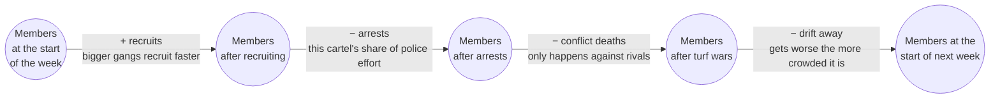
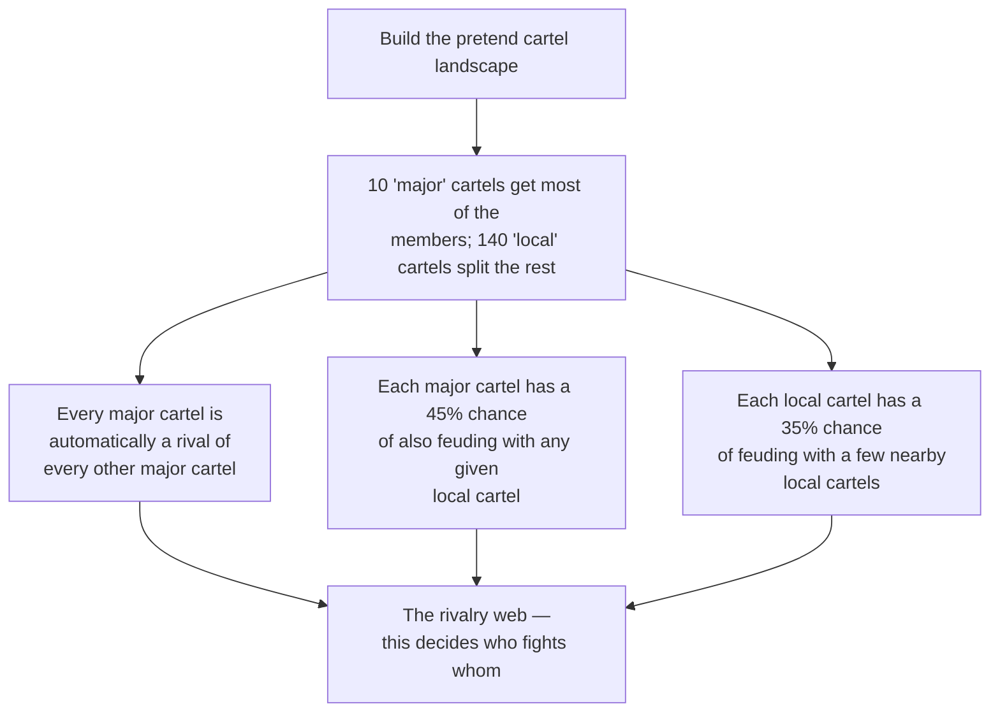
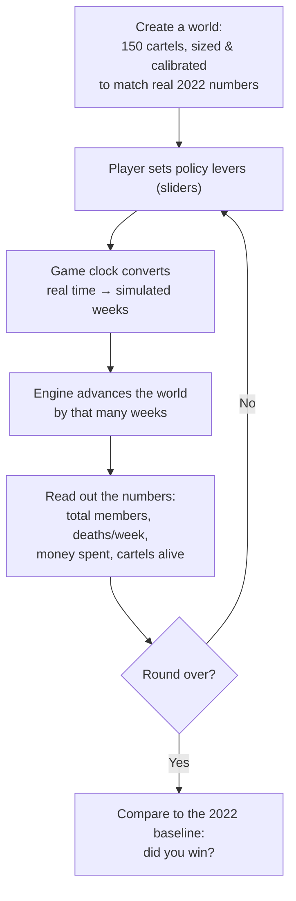
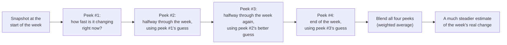

# The Cartel Engine

A little simulation of what it would take to shrink Mexico's cartels,
built from a real published model. This document explains **how it
works and why**, without assuming you know any math. If you're
curious about the formula it's built on, that's saved for the very
end.

There are two copies of the engine — [`cartel_engine.py`](cartel_engine.py)
and [`cartel_engine.ts`](cartel_engine.ts) — plus a browser dashboard in
[`web-dashboard/`](web-dashboard/). They all follow exactly the logic
described below; only the programming language differs.

Looking to actually call the engine from code? See [USAGE.md](USAGE.md)
for the method-by-method reference and worked examples.

---

## What this actually is

In 2023, three researchers (Prieto-Curiel, Campedelli & Hope) published
a model in the journal *Science* estimating how many people belong to
Mexican cartels, and what it would take to bring that number down.
This engine takes their model and turns it into something you can
*play with*: a simulated world of 150 cartels that you nudge using four
policy "levers," watching membership and violence rise or fall in
response, one simulated week at a time.

It is not a prediction tool. It's a calibrated toy that behaves the way
the real research says the real system behaves — so that pulling a
policy lever here teaches you something true about the trade-offs
policymakers actually face.

---

## The big idea: think of it like a bathtub

Every cartel is its own bathtub of people. Water flows in and water
flows out, every single week:

- **In:** new recruits
- **Out:** people who get arrested, people who get killed in gang
  conflict, and people who just drift away

If more water flows in than out, the cartel grows. If more flows out
than in, it shrinks — and if it drains completely, that cartel
dissolves.

The whole simulation is 150 of these bathtubs side by side, some of
them plumbed together by rivalry — when two rival cartels are both
big, they drain each other faster.



*(In the code all four things actually happen at once, not one after
another — this chain is just the easiest way to picture it.)*

---

## Meet the four forces

Every cartel is pulled by exactly four forces, every week. Here's what
each one means and, importantly, **which policy lever controls it**.

### 🟢 Recruitment — people joining

New members show up in proportion to how many members a cartel
*already has*. A bigger cartel has more recruiters on more corners, so
it recruits faster — success breeds success, which is exactly why
these organizations can spiral in size once they get big.

> **Lever:** *"Close the tap"* (recruitment prevention) — turns this
> tap down. At full strength it can cut recruitment to zero.

### 🚔 Incapacitation — people getting arrested

There's a fixed pool of police/military effort each week, and it gets
split across *all* cartels in proportion to their size — a cartel with
10% of all members absorbs about 10% of all arrests. This is why
arresting your way out of a large cartel problem is slow: enforcement
effort gets diluted across everyone.

> **Lever:** *"Run the pumps"* (enforcement effort) — this is the only
> lever that can go *above* its normal setting, up to 85% more
> arrests than the 2022 baseline.

### ⚔️ Conflict — people getting killed by rivals

This is the deadliest force, and the only one that depends on *two*
cartels at once: it only happens between cartels marked as rivals, and
it scales with **both** cartels' size. Two small rivals barely
scratch each other; two huge rivals tear each other apart. This is
the mechanism behind most cartel violence in the real data.

> **Lever:** *"Seal the cracks"* (conflict suppression) — dampens how
> lethal rivalries are, though only by up to 20%; this conflict is
> the hardest force to switch off.

### 🚪 Saturation — people drifting away on their own

Every cartel loses a trickle of members to natural attrition, and this
loss grows *faster* than the cartel itself — twice as many members
means *more than* twice as much drift. This is what stops cartels
from growing forever: a large, overcrowded organization becomes harder
to hold together, purely from its own size.

> **Lever:** *"Open the drain"* (fragmentation pressure) — the odd one
> out: pushing this lever *increases* this force instead of reducing
> it, deliberately encouraging cartels to fragment under their own
> weight. It's the cheapest lever by far.

A cartel that drops below a small membership threshold (40 people)
is considered dissolved and disappears from the simulation entirely.

---

## Cartels don't exist alone: the rivalry web

Before a game even starts, the engine builds a pretend but realistic
cartel landscape:

- **10 "major" cartels** hold the majority of all members (a heavy-tailed
  distribution — a few giants, many small players, just like the real
  landscape).
- **140 "local" cartels** split what's left.
- Rivalries are then handed out semi-randomly, using the same logic
  real turf wars tend to follow: major cartels fight each other and
  frequently prey on local ones, while local cartels mostly only feud
  with their near neighbors.



This whole landscape is generated from a single "seed" number, so the
same seed always builds the exact same cartel world — useful for fair
comparisons between two playthroughs.

---

## The game loop: how a "turn" works

The engine doesn't know or care what your game's clock looks like. You
tell it "advance by this many simulated weeks" as often as you like —
once per animation frame, once per player turn, whatever fits — and it
does the rest.



A "world" starts calibrated to real 2022 estimates: **175,000
members**, recruiting about **371 people a week**, losing about **110
a week to arrests** and **125 a week to cartel violence**. Those four
numbers are the anchor the whole simulation is tuned against.

---

## Under the hood: why the engine "peeks" four times a week

This part is the one genuinely technical idea in the engine, but it
doesn't require any math to understand *why* it's there.

If you only checked "how fast is membership changing *right now*" once
at the start of the week and assumed that rate held steady for the
whole week, you'd get a rough answer — but rates keep changing as the
week goes on (recruitment reacts to arrests, arrests react to rivalry
losses, and so on). So instead, the engine peeks at the rate of change
**four times** across the week, using each earlier peek to make a
smarter guess for the next one, and then blends all four together
into one much steadier estimate. This is a well-known technique called
**Runge-Kutta 4 (RK4)** — the engine doesn't invent it, just uses it.



If you ask the engine to advance by more than one week at a time, it
quietly breaks the request into one-week chunks and repeats this
four-peek process for each chunk, so a jump of a year behaves the same
as 52 separate one-week jumps.

---

## The levers: what you can actually do

| Lever | What it does in plain terms | How far it can go | Annual cost at max |
|---|---|---|---|
| **Close the tap** | Cuts new recruitment | Up to 100% off | MX$35,000M |
| **Run the pumps** | Boosts arrests/incapacitation | Up to 85% more than normal | MX$102,664M |
| **Seal the cracks** | Dampens rivalry violence | Up to 20% less lethal | MX$100,000M |
| **Open the drain** | Encourages cartels to fragment on their own | Up to 20% more drift | MX$15,000M |

You have a yearly security budget of **MX$190,491M** (Mexico's actual
2024 federal security spending) to spread across these four levers —
you can't just max everything out. That budget ceiling is where the
real trade-offs come from: enforcement is powerful but by far the most
expensive tool, while encouraging fragmentation is cheap but only
lightly effective.

---

## Winning and losing

There's no score — just one honest comparison. You're "winning" at any
moment if **both** of these are true:

- Total cartel membership is at or below the 2022 starting point
  (175,000)
- Weekly conflict deaths are at or below the 2022 starting point (125)

In other words: winning means the situation is *better than where
Mexico actually stood in 2022* — not zero cartels, not zero violence,
just measurably improved on both fronts at once.

---

## Two flavors, one engine

| File | Language | Role |
|---|---|---|
| [`cartel_engine.py`](cartel_engine.py) | Python (numpy) | Original engine |
| [`cartel_engine.ts`](cartel_engine.ts) | TypeScript | Browser/Node port, same logic |
| [`live_dashboard.py`](live_dashboard.py) | Python (matplotlib) | Live control-room UI, desktop |
| [`web-dashboard/`](web-dashboard/) | HTML/CSS/TypeScript | Live control-room UI, browser |

The TypeScript port uses its own small seeded random-number generator
instead of numpy's, so a given "seed" builds an equally valid but
different cartel landscape than the Python version — the *model
logic* is identical, only the random cartel layout differs.

---

## Glossary (code names → plain English)

The source code sticks close to the original paper's variable names.
Here's the translation:

| In the code | Plain English |
|---|---|
| `membersPerCartel` | How many people are in each cartel right now |
| `rivalryMatrix` | The rivalry web — who fights whom |
| `recruitmentRate` | How fast cartels recruit, per existing member |
| `incapacitationCapacity` | How many arrests happen per week, total |
| `conflictLethality` | How deadly rivalries are, per pair of rival members |
| `saturationRate` | How fast natural drift grows as a cartel gets bigger |
| `weeksElapsed` | Simulated time passed so far |
| `advanceByWeeks(n)` | "Run the simulation forward by `n` weeks" |
| `isWinning()` | Are you currently beating the 2022 baseline? |

---

## For the curious: the actual equation

Everything above is a translation of one line from the paper (Prieto-Curiel,
Campedelli & Hope, *Science* 381:1312–1316, 2023), describing how
cartel *i*'s membership changes per week:

```
dC_i/dt = r·C_i  −  h·C_i/C  −  q·Σ_{j≠i} C_i·C_j·S_ij  −  w·C_i²
          recruit   incapacitate      conflict            saturate
```

- `C_i` — members in cartel *i*; `C` — total members everywhere
- `r` — recruitment rate; `h` — total incapacitation capacity
- `q` — conflict lethality; `S_ij` — 1 if *i* and *j* are rivals, else 0
- `w` — saturation rate

Every term in that line maps directly onto one of the four forces
above — `r·C_i` is recruitment, `h·C_i/C` is incapacitation,
the sum term is conflict deaths, and `w·C_i²` is saturation drift.
